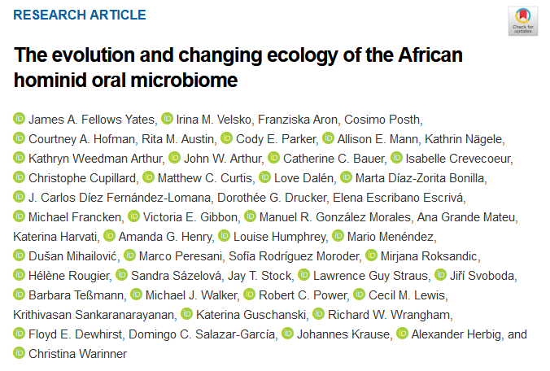
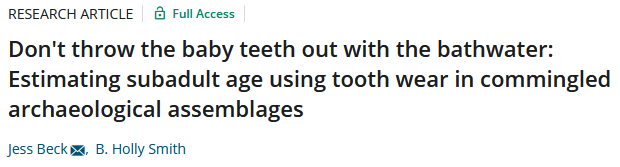
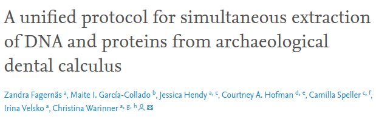
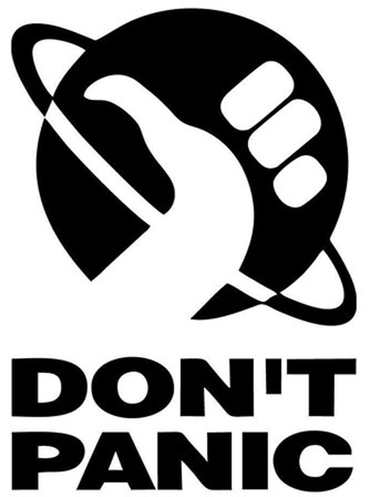
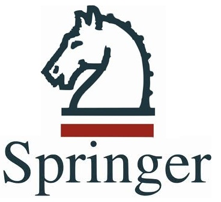
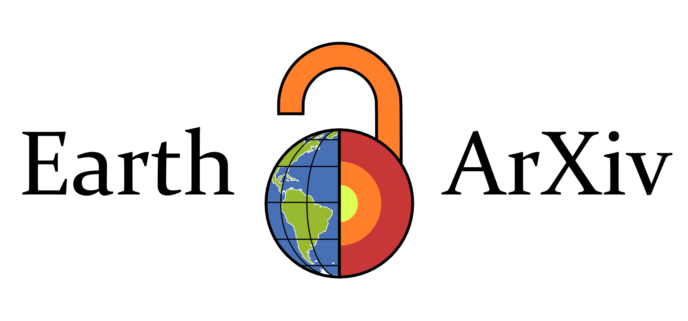
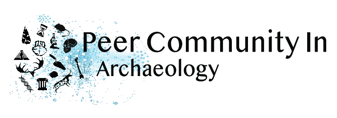
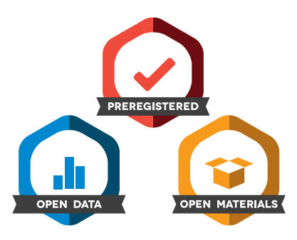
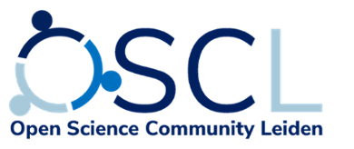

```{r setup, include=FALSE}
options(htmltools.dir.version = FALSE)
library(emo)
```

class: center,middle

>"Begin at the beginning and go on till you come to the end:  
then stop."  
> -- *Alice's Adventures in Wonderland*

---
class: center,middle,inverse

## So you want to publish your thesis?

---
class: center,middle

## Authorship

A somewhat controversial aspect of publishing... `r ji("cry")`

--

A typical journal article:

.list-left[
- **first author:** Main contributor (you)
- **last author:** Supervisor
- **middle:** order can be meaningful, but often irrelevant
]

**Supervision does not guarantee co-authorship**  
Although, if they helped you develop the original research project and
provided significant reviews of your work, they should be involved in the 
publication.

--

<div>
<a href="https://www.pnas.org/content/118/20/e2021655118">
 
</a>

<a href="https://onlinelibrary.wiley.com/doi/full/10.1002/oa.2802">
 
</a>

<a href="https://www.sciencedirect.com/science/article/pii/S0305440320300571?via%3Dihub">
 
</a>
</div>
---
class: center,middle

## Co-authors

`r ji("muscle")` Make sure they pull their weight  
`r ji("running")` Co-authorship has to be earned  
`r ji("clap")` And give credit where credit is due

.list-left[
- **Co-authorship:** significant contribution to the research, and/or manuscript
preparation.
- **Acknowledgements:** People who provided help in a limited form. (remember to thank your reviewers!)
]

Most journals will have a policy for authorship

Unfortunately, there is often politics and hierarchy involved...

---
class: center,middle

## Target Journal

#### Bioanth

American Journal og Physical Anthropology  
International Journal of Osteoarchaeology  
International Journal of Paleopathology  
Bioarchaeology International  
HOMO: Journal of Comparative Human Biology


#### Forensic Anthropology

Journal of Forensic Sciences  
Forensic Science International

#### Others

Journal of Archaeological Science(: Reports)  
Anthropological and Archaeological Sciences  
Science and Technology in Archaeological Research (STAR)

Journal rankings [archaeology](https://www.scimagojr.com/journalrank.php?category=1204) and [anthropology](https://www.scimagojr.com/journalrank.php?category=3314)

---
class: center,middle

## Bonus Journal: 

<a href="www.inter-section.nl">

</a>

--

Student journal here at the Faculty

--

Run by PhD students and post-docs

--

The editor-in-chief is a pretty cool guy `r ji("wink")`

--

Peer-reviewed and .open[Open Access]  

--

**More guidance than a standard academic journal**

---
class: center,middle

## Preparing a manuscript

[Open academics](https://www.oacommunity.org/resources)

--

.list-left[

Use a <b>reference manager</b> (if you don't already)

- I use [Zotero](https://www.zotero.org/) (because it's awesome and free!)
]

--

.list-left[
Version control

- First draft, version 1, final version, published, etc.
- If a heavily revised manuscript gets rejected, you may want to re-use stuff
  that was removed from a previous version

Cross-reference tables and figures `r ji("warning")`

- Trust me, it'll make your life easier...
]

--

`r ji("exclamation")`**GUIDELINES**`r ji("exclamation")`


Read the <b>guidelines</b> for your target journal  
Not following the <b>guidelines</b> is a quick way to get rejected


---
class: center,middle

## Preparing a manuscript

Don't worry too much about formatting, this is what publishers are paid to do

...but still follow the <b>guidelines</b>

**Read articles from your target journal**

--

### Supplementary material

If you think something is important but doesn't really fit in the manuscript.

Additional tables, graphs, data, code scripts, etc.

---
class: center,middle

## Submitting a manuscript

The submission process can take longer than expected

--

After finishing the manuscript, there may still be a lot to do

--

.list-left[
For example: 

- Fill in the online form
 + word count, table and figure count, and other formalities
- Keywords (don't underestimate the importance)
- Separate figures and tables from manuscript (usually)
- Cover letter to the editor
]
---
class: center,middle

## Reviews

Peer-review can be intimidating, but will ultimately improve your paper (most of the time...)

You will often be required to <b>track changes</b>

Comments are not personal (most of the time...)

.pull-left[
> <a quote> "35-49 years , rather than 35-48" </a>

> <a quote> "Commonly, when bone surface lesion is being assessed, the researcher must set a sort of lower limit for unusual features, which if not met will indicate that the condition was absent. Such information should be mentioned." </a>

]

.pull-right[
> <a quote> "I find the information about treatment irrelevant to the osteoarchaeological analysis." </a>

> <a quote> "one gets the feeling the paper was hurridly put together without giving much thought to the details" </a>

]

---
class: center,middle

## Rejection

--

Everyone has had a paper rejected. <b>EVERYONE</b>.

--

<b>Don't panic</b>. Use the (useful) comments and resubmit to a different journal



---
class: center,middle,inverse

# Open Science

---
class: center,middle

## Open Science

Open Access `r ji("unlock")`

Open Methods `r ji("cook")`

Open Data `r ji("bar_chart")`

--

Reproducibility vs. replication (often, wrongfully, conflated).

--

**Reproducibility:** Does the same analysis on the same data give the same result?  

--

**Replication:** Does the same analysis on different data give the same result?

---
class: center,middle

.left-column[

### Open Science

Open Access `r ji("unlock")`

.faded[Open Methods `r ji("cook")`

Open Data `r ji("bar_chart")`]

]

<div>

</div>

Why should anyone have to pay to view your work? `r ji("confused")`

--

Leiden University has .open[open access] agreements with the following publishers:

E(vil)sevier  
Wiley  
Springer  
And [more](https://www.library.universiteitleiden.nl/researchers/open-access/agreements-with-publishers)...

--

These agreements allow (first-)authors from Leiden University to publish .open[open 
access] in their journals at no cost.

Other journals will require a fee (APC) to publish .open[open access].

Leiden University .open[open access] [policy](https://www.library.universiteitleiden.nl/researchers/open-access/background-and-policies)


<br>




---
class: center,middle

.left-column[

### Open Science

.faded[Open Access `r ji("unlock")`]

Open Methods `r ji("cook")`

.faded[Open Data `r ji("bar_chart")`]]

Essential for reproducibility and replication  
Use of free open source software recommended

<br>

--

How many of you have tried testing other methods?

<br>

--

How easy/difficult was it?

<br>

--

**Keep in mind that others might want to reproduce and/or replicate your work.**

---
class: center,middle

.left-column[

### Open Science

.faded[Open Access `r ji("unlock")`

Open Methods `r ji("cook")`]

Open Data `r ji("bar_chart")`

]

Essential for reproducibility.

--

If the data are not available, this was likely also the case during the review

--

Can we trust the results?

--

The authors may be trustworthy, but people make mistakes (personal experience)

<br>

--

`r ji("warning")`**Caution**`r ji("warning")`

**Sensitive data**

.list-left[

- data that can be traced back to an individual
- data that may negatively affect a community
- can be masked or distorted
]

--

Make sure to discuss this with co-authors and the head of lab/curator first. 
You should be on the same page.

---
class: center,middle

## Preprinting

bioRxiv  
EarthArXiv  
PCI Archaeology  

`r ji("warning")`**Make sure your target journal allows pre-prints**`r ji("warning")`

<br>
<div class="footer">
  <a href="https://www.biorxiv.org/">
    
  </a>
  <a href="https://eartharxiv.org/">
    
  </a>
  <a href="https://archaeo.peercommunityin.org/">
    
  </a>
</div>

---
class: center,middle

## Open access repositories

<a href="https://osf.io/">

</a>


<a href="https://zenodo.org/">

</a>


Great for uploading your (.open[open access]) article and/or supplementary material

**NOT Academia or ResearchGate**

---
class: center,middle

## Other resources

[open-archaeo](https://open-archaeo.info/)

[Marwick et al. 2017](http://faculty.washington.edu/bmarwick/PDFs/Marwick_et_al_2017_SAA_Record_Sept.pdf)

[University Library](https://www.library.universiteitleiden.nl/researchers/open-science)

<a href="https://www.universiteitleiden.nl/open-science-community-leiden">

</a>

<br>

Slides available [here](https://bbartholdy.github.io/how-to-publishing/publishing.html#1)

---
class: center,middle,inverse

### Questions, Comments, Experiences?

Did I miss anything? ([contribute](https://github.com/bbartholdy/how-to-publishing/edit/main/publishing.Rmd) to slides)